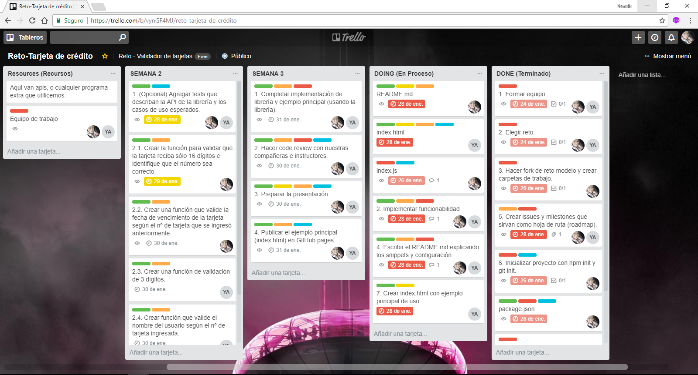
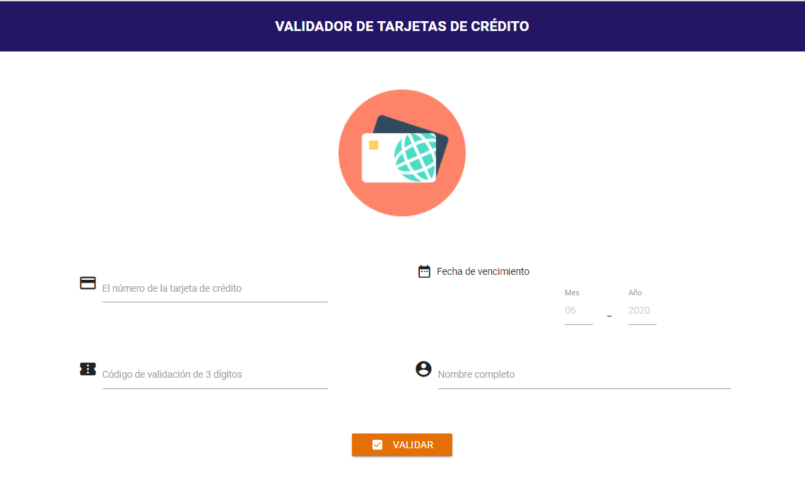
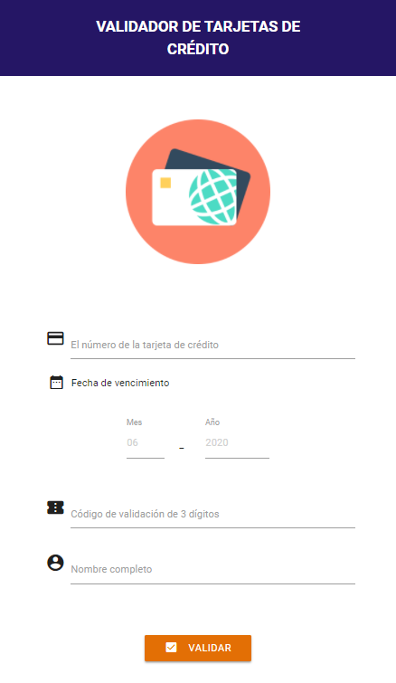

# Valida datos de tarjetas de crédito

* **Track:** _Common Core_
* **Curso:** _JS Deep Dive: Crea tu propia librería usando JavaScript_
* **Unidad:** _Producto final_
* **Reto:** _N° 1_

***
## Objetivo

Implementar un validador de datos de tarjeta de crédito. La librería debería validar
el número de tarjeta de crédito (usando algoritmo de Luhn), fecha de vencimiento,
código de verificación (cvv) y nombre completo que aparece en la tarjeta.

El plugin debe recibir una referencia a un elemento del DOM que contenga
`<input>`s con los id's para identificarlos.

## Planificación

La asignación de tareas se distribuyo por partes iguales, utilizando el software de administración *TRELLO*, desde el inicio que se formo el grupo seleccionando asi el **Reto 1 - (Card Validator).**
Puedes ver el tablero de planificación en el siguiente link: [https://trello.com/b/vynGF4MJ/reto-tarjeta-de-cr%C3%A9dito]()

### Semana 1
*_Miércoles 24 de Enero_*
* Formar equipo.
* Elegir reto.
* Hacer fork de reto modelo propuesto por Laboratoria.

*_Viernes 26 de Enero_*
* Crear index.html con ejemplo principal de uso.

*_Domingo 28 de Enero_*
* Escribir primera versión del README.md con una descripción general de la librería así como ejemplos (snippets) de uso y configuración (si fuera necesario).
* Crear issues y milestones que sirvan como hoja de ruta (roadmap).

### Semana 2
*_Domingo 28 de Enero_*
* Agregar tests que describan la API de tu librería y los casos de uso esperados.

*_Sábado 27 - Domingo 28 de Enero_*
* Implementar funcionalidad esencial.
* Hacer code review con tus compañeras e instructorxs.

### Semana 3
*_Lunes 29 - Miércoles 31 de Enero_*
* Completar implementación de librería y ejemplo principal (usando la librería).
* Hacer code review con tus compañeras e instructorxs.
* Preparar tu demo/presentación.
* Publicar el ejemplo principal (index.html) en GitHub pages.

## Progreso

### Libreria (Validación de tarjeta de crédito)
Proporciona utilidades de validación para las entradas de datos de la tarjeta de crédito.

## Instalación

* Clona éste repositorio: `[CardValidator](https://github.com/delacruzPamela/card-validator)`

* Necesitas enlazar en tu index dónde utilizarás el plugin `materialize.min.js` `jQuery`, `app.js`, `inde.js` y el JSON que usarás como base de datos `data.js`

~~~

~~~

* No olvides también enlazar los archivos css: `main.css` y `materialize.min.css`y `Material Icons`
  de la siguiente manera:

  ~~~
  <link rel="stylesheet" href="vendors/materialize/css/materialize.min.css">
  <link href="https://fonts.googleapis.com/icon?family=Material+Icons" rel="stylesheet">
  <link rel="stylesheet" href="css/main.css">
  ~~~

* Debes asignarle los sgts id's a los inputs que quieres validar :

~~~
* id = "num-card" // (Card Number): El número de la tarjeta de crédito
* id = "month" // (Mes): Fecha de expiración
* id = "year" // (Año): Fecha de expiración
* id = "input-cvv" // (Card Verification Value): Código de validación de 3 dígitos
* id = "input-name" // Nombre completo como aparece en la tarjeta
* id = "btn-validation" // Botón que validará que los datos ingresados en los 4
                          inputs pertenezcan al número de tarjeta ingresada.
~~~

* Éste plugin incluye un archivo `data.js` dónde está la estructura que debes respetar
  y los nombres donde pondrás los datos de los usuarios.

  Las keys que no debes modificar son `numCard`, `month`, `year`, `cvv` y `name`,
  sus valores sí.
  En el caso de `name` debes ingresarlo en mayúsculas para evitar errores de validación.

  ~~~
  let data = [
    {
      numCard: 4293875288227864,
      month: 01,
      year: 2025,
      cvv: 564,
      name: 'YANIRA ARENAZAS BUENO',
    },
    {
      numCard: 4551038207641635,
      month: 07,
      year: 2022,
      cvv: 565,
      name: 'PAMELA DE LA CRUZ LOZANO',
    },
    {
      numCard: 4551708214724851,
      month: 11,
      year: 2022,
      cvv: 566,
      name: 'VALERIA VALLES',
    },
    {
      numCard: 4214100119451427,
      month: 09,
      year: 2019,
      cvv: 567,
      name: 'ESTRELLA LOPEZ ROJAS',
    },
    {
      numCard: 4557880960617953,
      month: 12,
      year: 2021,
      cvv: 568,
      name: 'PAOLA ALVAREZ GONZALES',
    },
  ];
  ~~~

## Uso

  * Luego de haber enlazado y asignado todo lo descrito anteriormente, en el documento app.js
  podrás aplicar las siguientes funciones a tu formulario (`form`): `cvvValidation`, `nameValidation`,
  `isValidCard`, `dateExpiration` y `userValidation` ingresando como argumento el elemento
  (`etiqueta <input> o <a> o botón según corresponda`) que necesites de la siguiente manera:

  ~~~
  // js/app.js

  $(document).ready(begin);

  function begin() {
    $('#form').cvvValidation($('#input-cvv')); // <input> como argumento de la función.
    $('#form').nameValidation($('#input-name')); // <input> como argumento de la función.
    $('#form').isValidCard($('#num-card')); // <input> como argumento de la función.
    $('#form').dateExpiration($('#month'), $('#year')); // <input> como argumento de la función.
    $('#form').userValidation($('#btn-validation')); // <a> como argumento de la función.
  }
  ~~~

* Listo! ahora sí puedes disfrutar de nuestro plugin.

### Snippets

*Función para validad Número de tarjeta inválido
    : Esta función valida según el Algoritmo de Luhn que la tarjeta sea válida.
      Así mismo también valida que la longitud sea igual a 16 carácteres. Mientras el usuario ingrese
      datos que no cumplas las condiciones arriba descritas, saldrá un pequeños mensaje
      recordándole las restricciones, cuando los datos de ése campo pasen la validación el
      mensaje dejará de aparecer.

      ~~~
      $('#form').isValidCard($('#num-card'));
      ~~~

      _Snippets:_
      ~~~
      Input :  '4551038207641635' // validOne = true
      Input :  '583434' // validOne = false
      Input :  '1234567895555555' // validOne = false
      Input :  '' // validOne = false
      ~~~

* Función para validar mes y año de expiración
    : Cada input (mes y año) tiene como restricción el ingreso de 2 y 4 carácteres
      respectivamente. En el caso del `mes` se considera válido si el usuario ingresa
      un número >= 1 pero <=12, y en el caso del año se valida la longitud de 4 carácteres
      y que el número sea >= al año actual (2018). Mientras el usuario ingrese
      datos que no cumplas las condiciones arriba descritas, saldrá un icono de error y
      cuando los datos de ése campo pasen la validación el ícono dejará de aparecer.

      ~~~
      $('#form').dateExpiration($('#month'), $('#year'));
      ~~~

      _Snippets:_
      ~~~
      Input Mes :  '01' // validTwo = true
      Input Mes :  '13' // validTwo = false
      Input Mes :  '0' // validTwo = false
      Input Mes :  '' // validTwo = false
      ----------------------------------------
      Input Año :  '2018' // validTwo = true
      Input Año :  '2020' // validTwo = true
      Input Año :  '1999' // validTwo = false
      Input Año :  '202' // validTwo = false
      Input Año :  '' // validTwo = false
      ~~~

* Función para validar CVV de 3 dígitos
    : La siguiente función se encarga de validar mediante condiciones de longitud
      y tipo de datos que él usuario sólo ingrese 3 números. El input no permitirá
      ingresar más de 3 números. Si el usuario ingresa 3 números la variable `validThree`
       tendrá como valor `true`, si ingresa menos números o algo diferente a lo que se le
      solicita la variable `validThree` será igual a `false`. Mientras el usuario ingrese
      datos que no cumplas las condiciones arriba descritas, saldrá un pequeños mensaje
      recordándole las restricciones, cuando los datos de ése campo pasen la validación el
      mensaje dejará de aparecer.

      ~~~
      $('#form').cvvValidation($('#input-cvv'));
      ~~~

      _Snippets:_
      ~~~
      Input :  '586' // validThree = true
      Input :  '58' // validThree = false
      Input :  '' // validThree = false
      ~~~

* Función para validar nombre completo
    : La siguiente función se encarga de validar mediante condiciones dónde
      se testean los datos y se verifica la longitud del mismo. Si el usuario
      ingresa alguna palabra igual o mayor a `3` letras, la variable `validFour`
      tendrá como valor `true`, si ingresa menos letras o algo diferente
      a lo que se le solicitó la variable `validFour` será igual a `false`. El
      input por defecto ingresará el nombre completo todo en mayúsculas.

      ~~~
      $('#form').nameValidation($('#input-name'));
      ~~~

      _Snippets:_
      ~~~
      Input :  ' YANIRA' // validFour = true
      Input :  ' YAN3434' // validFour = false
      Input :  '3434' // validFour = false
      Input :  '  ' // validFour = false
      ~~~

* Función para validar datos según JSON
    : La siguiente función se encarga de validar que todos los datos ingresados
      pertenezcan al número de tarjeta de ingresó, todo esto validándolo con el
      JSON que tiene como base de datos. Si los datos son correctos los inputs
      se limpian y aparece el mensaje indicando que los datos son correctos, de
      contrario aparecerá un mensaje de error indicando que los datos no coinciden.

      ~~~
      $('#form').userValidation($('#btn-validation'));
      ~~~

## Herramientas utilizadas

* HTML5
* CSS3
* jQuery
* Node.js
* ECMAScript 6
* Materialize

## Producto Final

#### Sketch

* Se realizó dos tipos de prototipos de diferentes frameworks para poder seleccionar cual se maquetaria.

#### Versión desktop
* Vista desde la ventana del navegador desktop.

#### Versión móvil
* Vista desde la ventana del navegador móvil.

## Contribuidoras

* Pamela De la cruz Lozano
* Yanira Jazmín Arenazas Bueno
